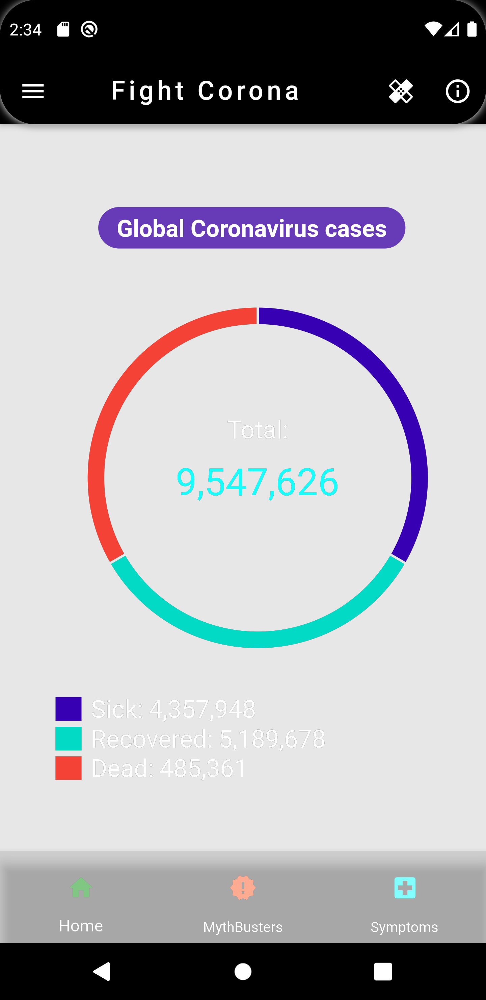
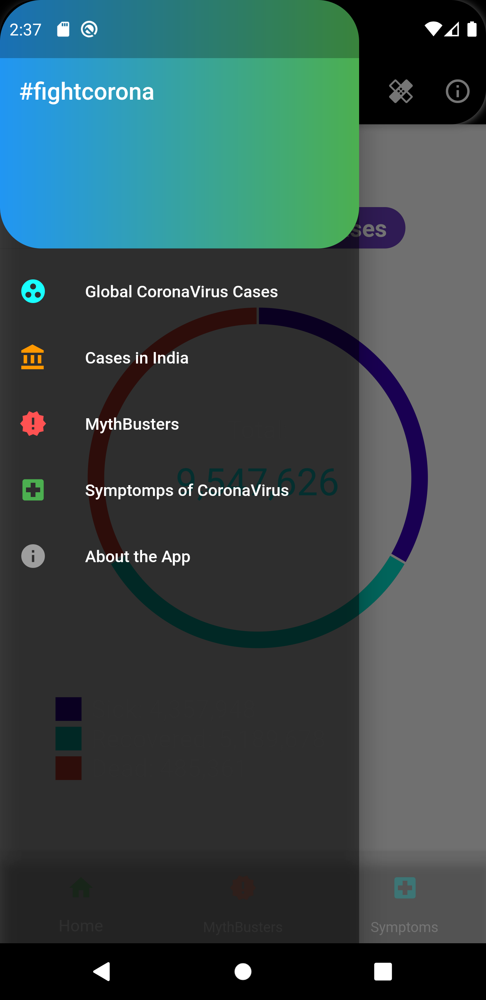
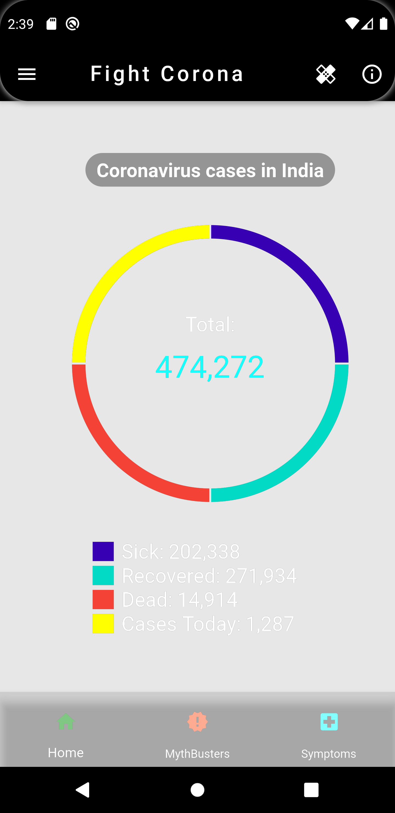
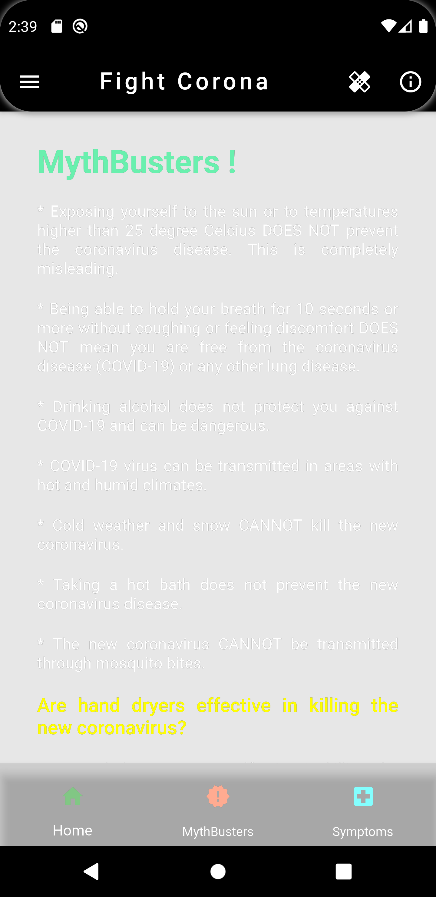
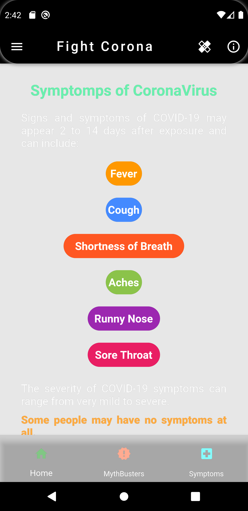
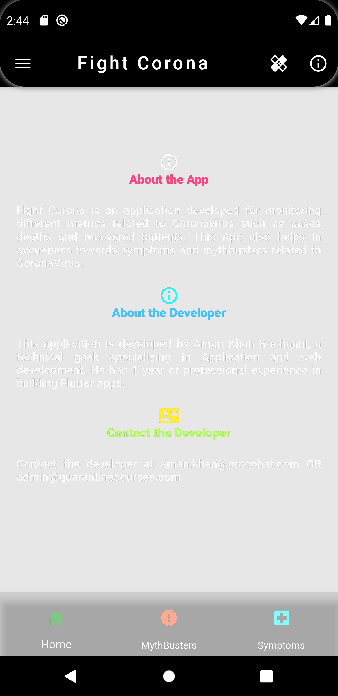

# Fight Corona

A new Flutter application featuring Global as well as Country-wide Coronavirus cases as well as mythbusters and tips to prevent Coronavirus. This is an excellent implementation of http requests flutter package,future builder and JSON parsing. GET method is used

I've used Coronavirus API for this which takes data from John Hopkins through WHO, and updates realtime.

## Getting Started

This project is a starting point for a Flutter application.

A few resources to get you started if this is your first Flutter project:

- [Lab: Write your first Flutter app](https://flutter.dev/docs/get-started/codelab)
- [Cookbook: Useful Flutter samples](https://flutter.dev/docs/cookbook)

For help getting started with Flutter, view our
[online documentation](https://flutter.dev/docs), which offers tutorials,
samples, guidance on mobile development, and a full API reference.

